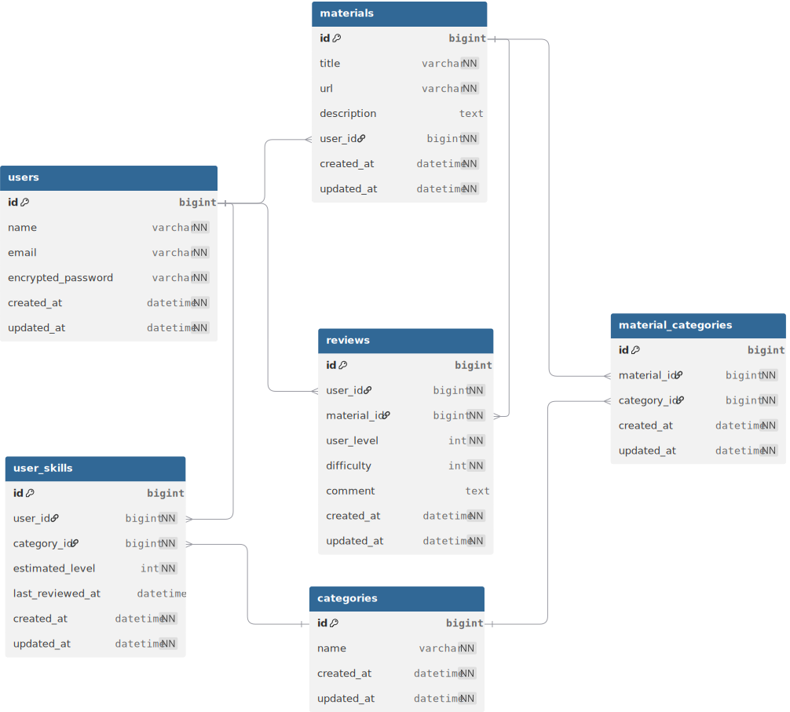

## サービス概要
学習教材を「自分のレベルから見た体感難易度」で評価・共有できるプラットフォームです。
教材に対して「Easy（簡単すぎた）/ Stretch（ちょうど良い）/ Overreach（難しすぎた）」と自分の開始レベルをセットで記録することで、
次の学習者が「今の自分にとって最適な教材か」を事前に判断できるようになります。


## このサービスへの思い・作りたい理由

プログラミング学習を始めてから、教材選びで何度も失敗してきました。

例えば、Udemyで★4.5の高評価だったRails講座を購入したとき、序盤は分かりやすかったのですが、中盤から急に前提知識が飛んで「これ、中級者向けだったのでは…？」と気づいたときには既に数時間を消費していました。逆に、「基礎を固めよう」と選んだ入門書が、自分にはすでに知っている内容ばかりで、達成感だけあって実力は何も上がらない――そんな経験を繰り返すうちに、**「教材の良し悪しではなく、自分との距離が問題なんだ」**と気づきました。

RUNTEQで学習を進める中で、同期や先輩からも「この教材どうだった？」「自分には難しすぎて挫折した」といった相談をよく受けました。その中で気づいたのは、同じ教材でも「初学者には難しすぎる」と言う人と「ちょうど良かった」と言う人が混在していて、**評価そのものよりも"誰が・どのレベルで使ったか"が重要**だということです。

学習を続ける中で、「成長とは"できることが増えること"であり、教材は"少し上"を目指すための道具だ」という考えに辿り着きました。**自分のレベルに対して"少し上"の教材こそが最も効率よく成長できる**と気づきましたが、その"少し上"を探すのが非常に難しいのが現状です。

このサービスは、過去の自分のように「頑張って選んだのに、結局自分に合わなかった」という時間の無駄を減らしたい、そして学習者が「自分の開始レベル」と「体感難易度」をセットで記録することで、次の学習者が**"今の自分にとっての Stretch（少し上）"**を事前に判断でき、全ての学習者が最短距離で成長できる世界を作りたい、という思いから生まれました。


## ユーザー層について

### 主要ユーザー層：プログラミング学習中の初学者〜中級者

**理由：**
- 学習の初期段階では、自分のレベルと教材の難易度のミスマッチが最も起こりやすく、挫折のリスクが高いため
- この層は「次に何を学ぶべきか」の判断が難しく、教材選びに最も時間を費やしている
- 成長速度が速い時期であり、適切な教材選択による効果が最も大きい


## サービスの利用イメージ

### 教材を探すユーザーの場合

#### MVP（最小限の機能）
1. **教材のタイトルで検索**（例：「Docker」「プロを目指す人のためのRuby入門」）
   - タイトルに検索キーワードを含む教材がヒットする
   - 検索結果は画面のメインエリアに表示される
2. **教材の評価一覧を確認**
   - 他の学習者が「どのレベルから始めて」「どう感じたか（Easy / Stretch / Overreach）」を見る
   - 例：「Railsの基本的なCRUDができる人」が「Stretch（ちょうど良かった）」と評価
   - 例：「プログラミング初めて」の人が「Overreach（難しすぎた）」と評価
3. **自分のレベルと照らし合わせて判断**
   - 「自分と同じレベルの人が Stretch と評価している教材」を選ぶ
   - 事前に難易度のミスマッチを避けられる
4. **教材を選んで学習開始**
   - 「少し頑張れば届く」教材で効率的に成長できる
   - 挫折リスクが減り、学習時間を無駄にしない

#### 理想の機能（MVP後に実装予定）
- **ログインユーザーのレベルに基づくおすすめ表示**
   - ユーザーのレベル情報から、「今のあなたにおすすめの教材」を自動表示
   - 画面下部など、目立ちすぎない専用エリアに表示
   - 例：「Rubyのレベルを持っている人」には、Ruby関連の教材を提案
- **パーソナライズされたおすすめ機能**
   - 学習履歴や「いいね」した教材の傾向から、ユーザーに最適な「Stretch教材」を提案
   - 検索結果とは別の専用エリア（フッター付近など）に表示
   - 検索結果のメインエリアを邪魔しない設計


---


### 教材を評価するユーザーの場合

#### MVP（最小限の機能）
1. **学習完了した教材を登録**（例：「プロを目指す人のためのRuby入門」）
2. **学習開始時の自分のレベルを記録**
   - 例：「HTML/CSSは書けるが、JavaScriptは初めて」
   - 例：「Railsの基本的なCRUDは理解している」
3. **体感難易度を選択**
   - **Easy**：既に知っている内容が多く、新しい学びが少なかった
   - **Stretch**：頑張れば理解でき、確実にレベルアップできた
   - **Overreach**：前提知識が足りず、途中で挫折した / 理解が追いつかなかった
4. **評価を投稿**
   - 「このレベルの人が、この教材をこう感じた」という情報が蓄積される
   - 次の学習者が「自分と同じレベルの人の評価」を参考にできる

#### 理想の機能（MVP後に実装予定）
- **ユーザーの保有スキルレベルの自動推定**
   - ユーザーAさんが過去に複数の教材を評価している場合、その評価内容から「Aさんは HTML/CSS ができる」「Rails の基礎は理解している」といったスキルレベルを自動で推定
   - 新しい教材を評価する際に、「HTML/CSS ができる人からの評価」として自動的に記録される
   - ユーザーが毎回レベルを入力する手間が減る


## ユーザーの獲得について

- RUNTEQや学習者コミュニティ（Discord、勉強会）で共有
    
- Zenn/Qiitaで「教材レビューが参考にならない」「対象レベルが見えない」という課題を記事化して流入を作る
    
- 投稿のハードルを下げる（テンプレ＋自由記述で短時間投稿できるようにする）


## サービスの差別化ポイント・推しポイント

### 類似サービスとの比較

#### 既存の教材評価サービスとの違い

| 項目 | 既存サービス | 本サービス |
|------|------------|-----------|
| **評価の軸** | 教材の絶対評価（★1〜5） | **学習者のレベルからの相対評価**（Easy / Stretch / Overreach） |
| **評価者の情報** | 不明（誰が評価したか分からない） | **評価者の開始レベルがセットで記録される** |
| **教材選びの基準** | 「良い教材かどうか」 | **「今の自分に合う教材かどうか」** |
| **ミスマッチの防止** | 難しい（レビューを読み込む必要がある） | **自分と同じレベルの人の評価を見るだけで判断できる** |

### 推しポイント

#### 1. **「自分のレベル」と「体感難易度」をセットで記録する仕組み**
- 既存サービスでは、教材の絶対評価（★1〜5）しか分からないため、「誰にとって良い教材か」が不明
- 本サービスでは、**「このレベルの人が、この教材をこう感じた」という情報が蓄積される**
- 次の学習者が「自分と同じレベルの人の評価」を見ることで、事前に難易度のミスマッチを避けられる

#### 2. **「Stretch（少し上）」の教材を見つけやすくする**
- 学習者にとって最も効率的に成長できるのは、「少し頑張れば届く」教材
- 既存サービスでは、「良い教材」は見つかるが、「自分にとっての Stretch」を探すのが難しい
- 本サービスでは、**「自分と同じレベルの人が Stretch と評価した教材」を優先的にチェックできる**


## 機能候補

### MVPリリース時に作りたい機能

#### 1. ユーザー機能
- ユーザー登録・ログイン機能（メールアドレス＋パスワード）
- プロフィール編集機能（名前など）

#### 2. 教材機能
- 教材の登録機能（タイトル、URL、説明）
- 教材の一覧表示機能
- 教材の詳細表示機能
- 教材のタイトル検索機能

>どこのURLを想定してますでしょうか？  
については
本であれば、その出版社のURLの該当ページ
YouTubeや、Udemyなどwebサイトであればqiita, zennなど。
また公式ドキュメントなどに関しても同様にURLです。

>説明は公式サイトの説明を貼り付けるイメージでしょうか？
については
はい、公式の説明を貼り付けるイメージです。

#### 3. 評価機能
- 教材に対する評価の投稿機能
  - 学習開始時の自分のレベルを記録(選択式)
  - 体感難易度を選択（Easy / Stretch / Overreachなどの簡単~難しいという難易度の選択）
  - コメント（任意）
- 教材の詳細ページでの評価一覧表示
  - 評価者のレベルと体感難易度がセットで表示される

>> - 教材に対する評価の投稿機能
>> - 学習開始時の自分のレベルを記録(選択式)
については
教材の難易度の選択肢は以下の通りです。
```
1. とても優しい(サクサク進められる)
2. 優しい(初心者でも安心)
3. ちょうどいい(適度に考えさせられる)
4. 難しい(じっくり取り組む必要がある)
5. とても難しい(かなり手応えがある)
```
学習者のレベルの選択肢としては以下の通りです。
```
1. 全くの初心者（この分野に初めて触れる）
2. 入門レベル（基本的な用語は知っている）
3. 基礎レベル（簡単な実装ができる）
4. 中級レベル（一人で機能を作れる）
5. 上級レベル（設計や最適化ができる）
```

---

### 本リリースまでに作りたい機能

#### 1. 評価機能の拡充
- 評価へのいいね機能
  - 「この評価が参考になった」をカウント
  - いいね数の多い評価を優先表示
- 評価のフィルタリング機能
  - 「Stretchと評価した人」だけを表示
  - 「自分と同じレベルの人の評価」を優先表示

#### 2. レコメンド機能
- ログインユーザーのレベルに基づくおすすめ表示
  - ユーザーのレベル情報から、「今のあなたにおすすめの教材」を自動表示
  - 画面下部など、目立ちすぎない専用エリアに表示
- パーソナライズされたおすすめ機能
  - 学習履歴や「いいね」した教材の傾向から、ユーザーに最適な「Stretch教材」を提案

#### 3. 教材機能の拡充
- 教材のカテゴリ分け（プログラミング言語、フレームワーク、インフラ等）
- 教材のタグ機能（例：「初心者向け」「実践的」「理論重視」）


## 使用する技術スタック

### 使用するフレームワーク

- Ruby on Rails 7.2
    
- TailwindCSS

### データベース

- PostgreSQL（タグや集計、将来の拡張に対応しやすい）
    

### デプロイ先

- Render
    

### 使用予定のライブラリ

- 認証：Devise（またはSorcery）
    
- 検索：Ransack
    
- タグ：acts-as-taggable-on（分野・目的など）
    
- ページネーション：kaminari
    
- 開発環境 : docker

### 画面遷移図
[Figmaの画面遷移図](https://www.figma.com/design/n8oV8ZjUoGYIyR3qp3dL89/%E7%84%A1%E9%A1%8C?node-id=0-1&t=KowYgw8yjgymI8KK-1)

## ER図



